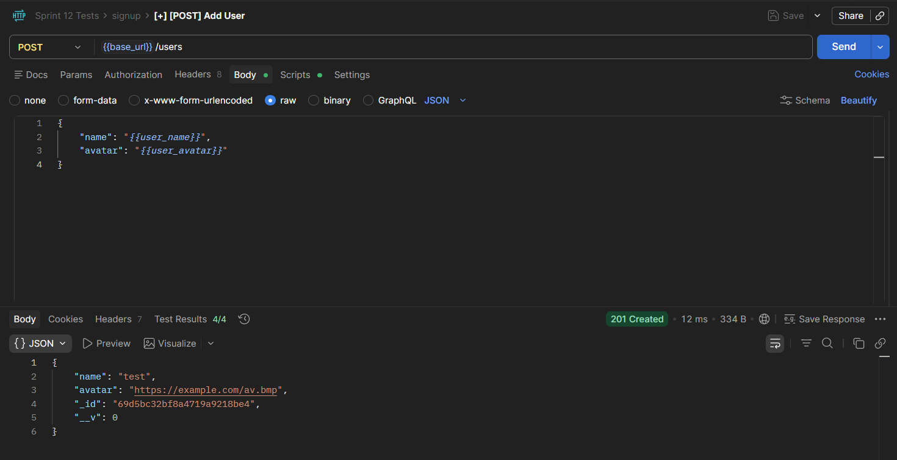

# WTWR (What to Wear): Back End

This project provides the back end API for the WTWR application. It connects to MongoDB, stores users and clothing items, and exposes routes for creating users, creating and deleting items, and liking or unliking clothing items.

## Functionality

The server supports these main features:

- Create and fetch users
- Create, fetch, and delete clothing items
- Like and unlike clothing items
- Return consistent JSON error responses for invalid data, invalid IDs, missing resources, and server errors

## Technologies and Techniques

- Node.js and Express for the HTTP server and routing
- MongoDB and Mongoose for schemas, models, validation, and database access
- ESLint with airbnb-base for code quality
- Prettier and EditorConfig for consistent formatting
- REST-style routing with controllers separated from route definitions

## Examples of API Requests

Create a user:

Create an item:

Like an item:

Error response for a user with "name" field less than 2 characters:

