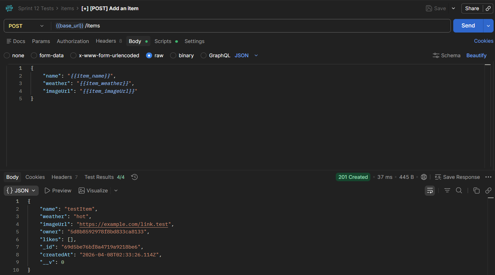
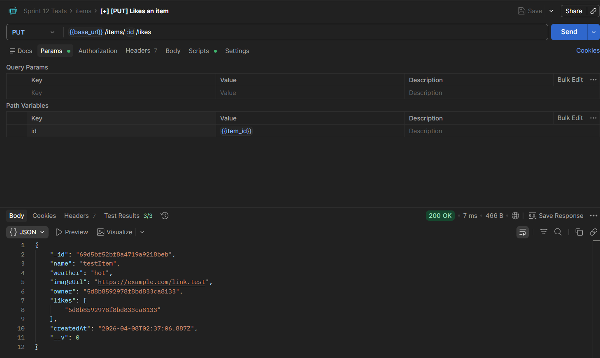
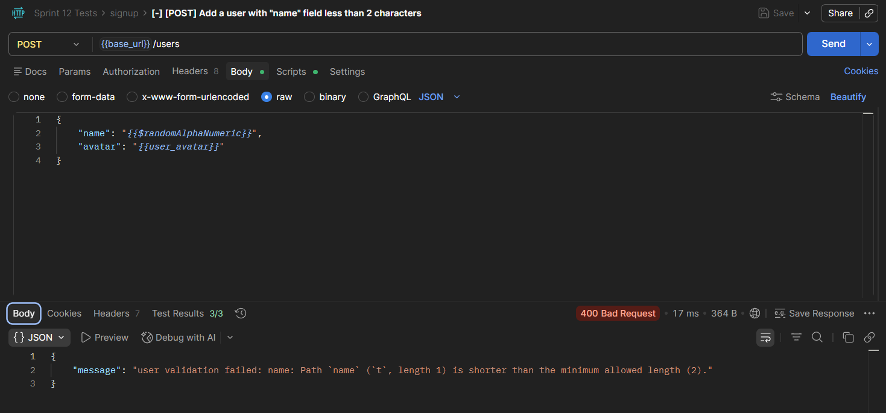

# WTWR (What to Wear): Back End

This project provides the back end API for the WTWR application. It connects to MongoDB, stores users and clothing items, supports signup and signin with JWT authorization, and exposes routes for managing user profiles and clothing items.

## Functionality

The server supports these main features:

- Sign up and sign in users
- Hash user passwords before saving them
- Return a JWT after successful login
- Protect private routes with authorization middleware
- Get and update the current user's profile
- Create, fetch, and delete clothing items
- Prevent users from deleting clothing items they do not own
- Like and unlike clothing items
- Return consistent JSON error responses for invalid data, invalid IDs, unauthorized requests, forbidden actions, duplicate emails, missing resources, and server errors

## Technologies and Techniques

- Node.js and Express for the HTTP server and routing
- MongoDB and Mongoose for schemas, models, validation, and database access
- ESLint with airbnb-base for code quality
- Prettier and EditorConfig for consistent formatting
- REST-style routing with controllers separated from route definitions
- bcryptjs for password hashing
- jsonwebtoken for JWT-based authorization
- cors for allowing client requests
- validator for URL and email validation

## Examples of API Requests

Create a user:

Create an item:

Like an item:

Error response for a user with "name" field less than 2 characters:

## API Routes

Public routes:

- `POST /signup` - create a new user
- `POST /signin` - log in and receive a JWT
- `GET /items` - get all clothing items

Protected routes:

- `GET /users/me` - get the current user's profile
- `PATCH /users/me` - update the current user's name and avatar
- `POST /items` - create a clothing item
- `DELETE /items/:id` - delete a clothing item owned by the current user
- `PUT /items/:id/likes` - like a clothing item
- `DELETE /items/:id/likes` - unlike a clothing item

## Project Pitch Video

Check out [this video](https://drive.google.com/file/d/1zEoiPOcDTgOOejHQU3CU202Ue-NHEfRE/view?usp=sharing), where I describe my project and some challenges I faced while building it.
